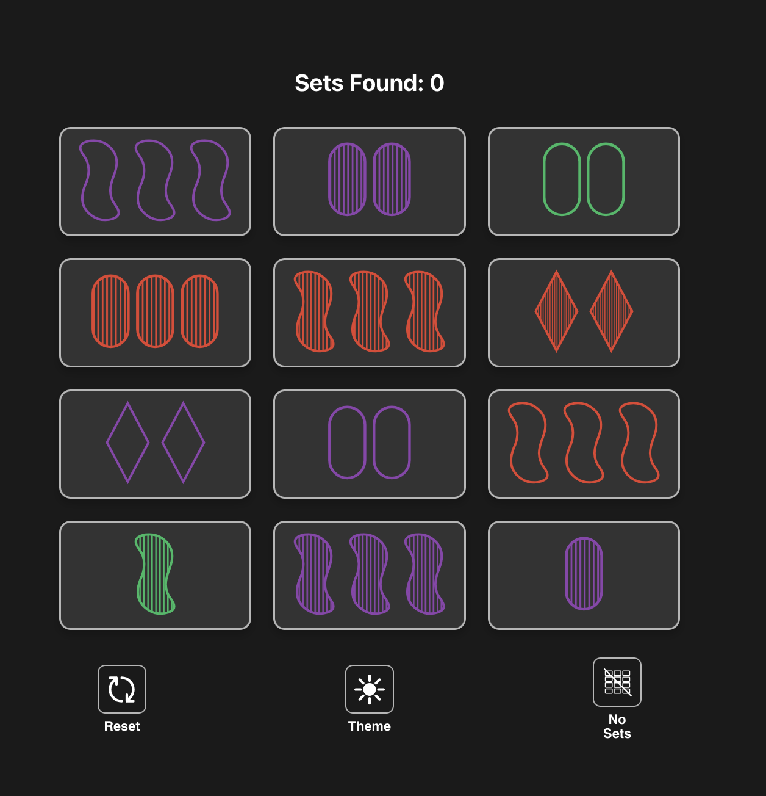
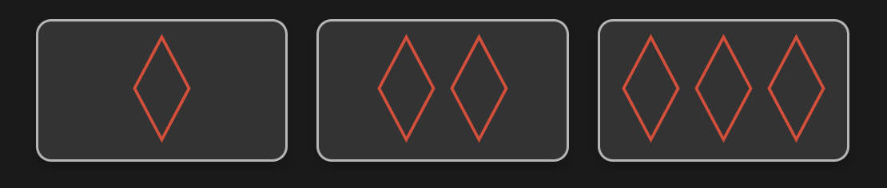
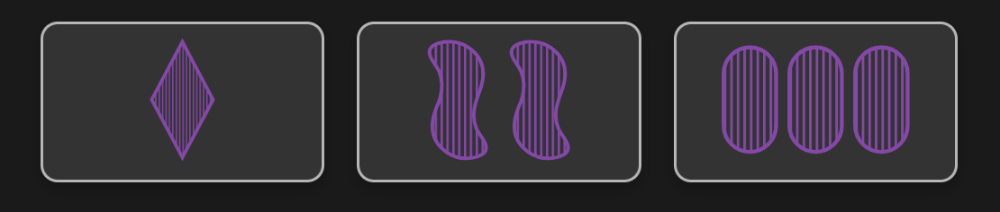

# Game of Set – React App
`Nolan Cyr 2025`

## Rules of Set

### Objective
The goal is to identify a `SET` of 3 cards from the cards displayed on the table. A `SET` consists of 3 cards where each feature:
- shape
- color
- number
- shading

is either all the same or all different on the three cards.

> **A good test:** If two are and one is not, it is **NOT** a set

### Valid `SET` Examples

- **Shape:** All `DIAMOND` ✅
- **Color:** All `RED` ✅
- **Number:** All _different_ (`1`,`2`,`3`) ✅
- **Shading:** All `OPEN` ✅

- **Shape:** All _different_ (`DIAMOND`, `SQUIGGLE`, `OVAL`) ✅
- **Color:** All `PURPLE` ✅
- **Number:** All _different_ (`1`,`2`,`3`) ✅
- **Shading:** All `SHADED` ✅

- EVERYTHING _different_
  - **Shape:** `DIAMOND`, `SQUIGGLE`, `OVAL` ✅
  - **Color:** `RED`, `PURPLE`, `GREEN` ✅
  - **Number:** `1`,`2`,`3` ✅
  - **Shading:** `SOLID`, `SHADED`, `OPEN` ✅

### Invalid `SET` Example

- **Shape:** **INVALID**. Two are `SQUIGGLE`, the other is `DIAMOND` ❌
- **Color:** All `GREEN` ✅
- **Number:** All _different_ (`1`,`2`,`3`) ✅
- **Shading:** `OPEN`, `SHADED`, `SOLID` ✅

### Gameplay
- 12 cards (of a total 81) are displayed
- Click a combination of 3 cards that form a `SET`. If valid, the respective cards are replaced and you gain a point.
- If you select 3 cards that do NOT form a `SET`, you lose a point.
- If you believe no sets exist on the current board, click the `No Sets` button.
    - If there are in fact no sets, 3 additional cards are added to the board. The next set found is not replaced to return the board to 12 cards.
    - If there is a set on the board, you will lose 1 point for this action. Be patient!
- The game ends when the deck is depleted and there are no remaining sets on the board (to which you press "No Sets"). You will know this when cards are not replaced (or you have > 24 sets). 

### Notes
- There is always a high probability of finding a SET among 12 cards.
- A `Perfect Game` is when you use all 81 cards forming a total of 27 `SETS`. The final 3 cards are also guaranteed to be a `SET` in this scenario.

### Credit

- Rules are adapted from the official rulebook of the SET® card game by Cannei, LLC. © 1998, 1991 Cannei, LLC. All rights reserved. 
- `SVG` drawing for the squiggle thanks to Jacob Belanger. [His code](https://codepen.io/jacob_124/pen/vdYdPX). All other work is original. 

<!-- 
### `yarn build`

Builds the app for production to the `build` folder.\
It correctly bundles React in production mode and optimizes the build for the best performance.

The build is minified and the filenames include the hashes.\
Your app is ready to be deployed!

See the section about [deployment](https://facebook.github.io/create-react-app/docs/deployment) for more information.

## Learn More

You can learn more in the [Create React App documentation](https://facebook.github.io/create-react-app/docs/getting-started).

To learn React, check out the [React documentation](https://reactjs.org/). -->
